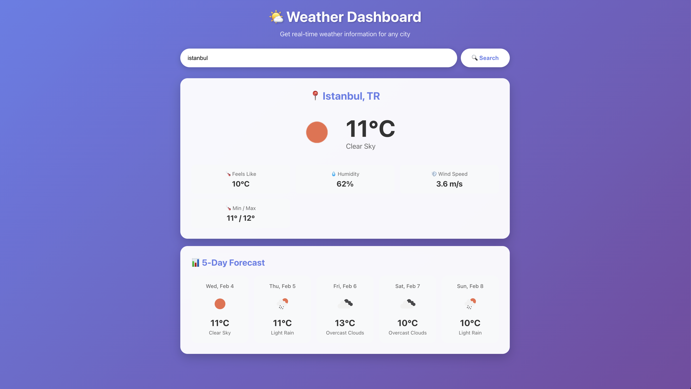

# 🌤️ Weather Dashboard

> A beautiful, real-time weather dashboard built with React. Get current weather and 5-day forecasts for any city worldwide.

<div align="center">


</div>

---

## ✨ Features

- 🌍 **Global Coverage** - Search weather for any city worldwide
- 🌡️ **Current Weather** - Real-time temperature, humidity, wind speed
- 📊 **5-Day Forecast** - Detailed weather predictions
- 🎨 **Beautiful UI** - Modern gradient design with smooth animations
- 📱 **Responsive** - Works perfectly on mobile, tablet, and desktop
- ⚡ **Fast & Lightweight** - Quick loading and smooth performance

---

## 🎥 Demo



### Live Demo
- Clone the repository and run locally to see it in action!
- Search for any city (e.g., Istanbul, Tokyo, New York)

---

## 🚀 Quick Start

### Prerequisites

- Node.js 14+ installed
- OpenWeatherMap API key (free)

### Installation

1. **Clone the repository**
```bash
git clone https://github.com/demetsenol/weather-dashboard.git
cd weather-dashboard
```

2. **Install dependencies**
```bash
npm install
```

3. **Get your API key**

- Go to [OpenWeatherMap](https://openweathermap.org/api)
- Sign up for a free account
- Get your API key from the dashboard

4. **Configure environment variables**

Create a `.env` file in the root directory:
```bash
cp .env.example .env
```

Edit `.env` and add your API key:
```bash
REACT_APP_WEATHER_API_KEY=your_actual_api_key_here
```

5. **Start the development server**
```bash
npm start
```

The app will open at `http://localhost:3000` 🎉

---

## 🛠️ Built With

- **React** - Frontend framework
- **Axios** - HTTP client for API calls
- **OpenWeatherMap API** - Weather data provider
- **CSS3** - Styling with animations

---

## 📁 Project Structure
```
weather-dashboard/
├── public/
│   └── index.html
├── src/
│   ├── components/
│   │   ├── SearchBar.js       # City search component
│   │   ├── CurrentWeather.js  # Current weather display
│   │   └── Forecast.js        # 5-day forecast
│   ├── App.js                 # Main application
│   ├── App.css                # Styling
│   └── index.js               # Entry point
├── .env.example               # Environment variables template
├── .gitignore
├── package.json
└── README.md
```

---

## 🎨 Features in Detail

### Current Weather Display

- City name and country
- Current temperature
- Weather description with icon
- "Feels like" temperature
- Humidity percentage
- Wind speed
- Min/Max temperature

### 5-Day Forecast

- Daily weather predictions
- Temperature trends
- Weather icons
- Detailed descriptions

### User Experience

- Smooth animations
- Loading indicators
- Error handling
- Responsive design
- Clean, modern interface

---

## 🌐 API Reference

This app uses the [OpenWeatherMap API](https://openweathermap.org/api):

- **Current Weather Data**: `/weather`
- **5-Day Forecast**: `/forecast`

API calls are made with metric units (Celsius, m/s).

---

## 📱 Screenshots

### Desktop View
Beautiful gradient background with centered layout

### Mobile View
Fully responsive design for mobile devices

---

## 🚧 Future Enhancements

- [ ] Weather charts (temperature, humidity trends)
- [ ] Geolocation support
- [ ] Save favorite cities
- [ ] Dark/Light theme toggle
- [ ] Weather alerts
- [ ] Multiple language support
- [ ] Hourly forecast
- [ ] Weather maps

---

## 🤝 Contributing

Contributions are welcome! Feel free to:

1. Fork the project
2. Create your feature branch (`git checkout -b feature/AmazingFeature`)
3. Commit your changes (`git commit -m 'Add some AmazingFeature'`)
4. Push to the branch (`git push origin feature/AmazingFeature`)
5. Open a Pull Request

---

## 📄 License

This project is open source and available for personal and educational use.

---

## 📧 Contact

**Demet Şenol**

- 📧 Email: [demet.senoll14@gmail.com](mailto:demet.senoll14@gmail.com)
- 💼 LinkedIn: [linkedin.com/in/demet-senol](https://linkedin.com/in/demet-senol)
- 🐱 GitHub: [@demetsenoll](https://github.com/demetsenoll)

---

<div align="center">

**⭐ If you like this project, please give it a star! ⭐**

Made with ❤️ by Demet Şenol

</div>